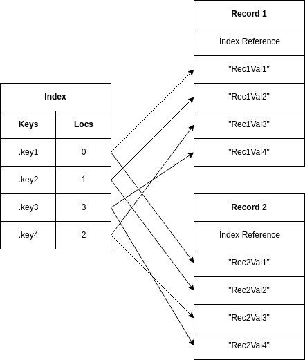
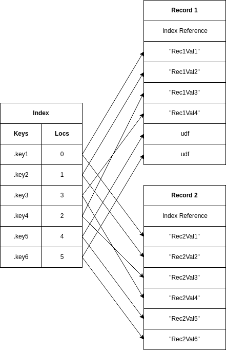

# <a name="2">2 - Basic Concepts</a>
This section of the manual describes some of the basic concepts
behind Ten in a less formal manner than used in the language
definition section.

## <a name="2.1">2.1 Values</a>
Ten is a dynamically typed language, so types are attached to values
themselves rather than their variables, and variables can hold values
of any type.

Ten's value types are divided into two groups: atomic types and object
types.  Atomic types represent simpler values which can be fully
contained within a machine word.  Object types on the other hand are
allocated in heap memory, with only a reference stored in the value.
The two major differences between these are:

1. Atomic types can be compared naturally with the `=` operator,
   which compares the raw value words, while for object types
   this only serves to check for a specific instance.
2. Ten values are copied when passed around between functions and
   variables, so atomic values (which are self contained) are copied
   as well.  But object values are just references to heap memory,
   so even when copied they refer to the same entity; so any changes
   made through one reference will be visible to all the others.

Ten has seven atomic value types:

- `Udf` - A type with the single value `udf`, used for representing
  undefined or unknown value, and is given special semantics to prevent
  the propagation of bugs.
- `Nil` - Another single value type for `nil`, this one represents
  'nothing' and has no special semantics.
- `Log` - This type has two values: `true` and `false`.  It's used
  as the return type of comparisons, and as the basis for logical
  operations.
- `Int` - This type represents a 32 bit signed integral type.
- `Dec` - And this one's a 64 bit floating point type.
- `Sym` - Symbols are strings, but interned for fast comparison.  These
   should typically be used as record keys and enumeration options, but
   we also use them as multibyte characters.
- `Ptr` - This is for raw C pointers, the type allows us to pass them
  around to native functions and keep them in the Ten runtime.

And seven object value types:

- `Str` - Represents an immutable sequence of bytes.  Ten doesn't care
  what the bytes represent, though they'll often be used as text; and
  the prelude provides functions for reading them as UTF-8 text in
  particular.
- `Idx` - This is an auxiliary type representing the shared lookup tables
   used by records.  We'll typically never need to have much contact with
   these since they usually just exist behind the scenes.
- `Rec` - Records are hash maps, or associative arrays; but they're
  allowed to share state between instances, making them more efficient
  with memory than typical designs while sacrificing some speed and
  flexibility.
- `Fun` - Another auxiliary type representing the immutable state shared
  between closures.  Functions represent the code itself, including
  constants, while closures combine code with state.
- `Cls` - Closures are Ten's only callable/executable type.  These
  are the functions of other languages, and depending on the context,
  we'll often just call them functions.
- `Fib` - The fiber type represents an independent thread of execution.
  These aren't operating system threads, they're cooperative userspace
  threads implemented in standard C, and do not run in parallel.
- `Dat` - This is the 'object' counterpart to the `Ptr` type.  Objects
  of this type provide chunks of raw memory which can be accessed and
  mutated by host code or native functions, but don't serve much purpose
  in pure Lua code.

Ten code can both call and be called by native code in C or other
languages, so the `Dat` and `Ptr` types provide a means for Ten
to 'hold on to' data from these other languages without compromising
its own type system and runtime safety.

Record fields can have keys of any value type except `Udf`, and
values of any type including `Udf`.  Record fields and variables
with a value of `udf` are considered to be non-existent for all
semantical purposes, and may be deleted internally by the runtime.
Any references to undefined variables or record fields will also
result in the `udf` value.

The prelude function `type()` returns the type of a given value
as a three byte symbol containing one of the above type names.

## <a name="2.2">2.2 - Records</a>
As mentioned previously, while Ten's records are a form of hash map,
they aren't _just_ hash maps.   Ten's records are allowed to share
state between instances, and the part that is shared is the lookup
table (the actually hash map), which is the part that needs most of
the memory; so by avoiding duplicates of this we save a lot of space.

The relationship between records and indices is depicted in the
following graphic:

The index is a hash map between record keys and value slots, the
`Locs` of the index tell records where, in their local value store,
to put the value matching this key.

Since the index is shared, all peer records (those with a common
index) need to allocate a enough slots to accommodate the keys of
all records in the pool; this is why they should maintain a similar,
of not exactly the same, set of keys.

As one record gains keys that none of the others use, the others
still need to allocate room for it.  Since sharing the lookup
table saves a lot of space in itself, there's a certain amount
of tolerance for outstanding keys, used by only a fraction of
the peer records, where sharing an index with these records is
still more efficient than allocating a new index of the deviating
records; this tolerance is reduced however as the number of
common records increases, and the number of outstanding ones
decreases.

The above figure shows how, even for only two peers, one having
extra keys not shared by the other can lead to wasted value slots.

Once records achieve a certain capacity, they'll never shrink again.
Indices themselves never 'deallocate' slots; instead if a key disappears
from all referencing records its slot will be recycled for the next
definition.  Thus to avoid records that grow exponentially, only to
have the extra slots never used, and never deallocated, Ten just
doesn't grow them exponentially.  Records will maintain their smallest
possible size at all times (large enough for all index slots), so for
every _new_ definitions added to a record (one not in the record, and
not in the index) the record will have to realloc to accommodate the
new slot.  This leads to slow definitions for outstanding keys, but
after the first addition to a shared index, any new records using
the index will be much more efficient even than traditional hash
maps as they won't need to realloc at all for common keys.

This record system is much more suitable for implementing structs
and objects, where many instances of the same structure will be
created; than as more unique hash map containers for large data
sets.  Where high performance and efficiency is needed for unique
hash maps these should typically be implemented in the host language,
to be specialized and optimized for the particular purpose.

If performance is less of a factor, then records can be used as
more general purpose containers, but should first be separated
from the original index to avoid contaminating it; this copies
the subset of the records index being used by the specific index
into a new index to replace it, separating the record from the
original, which might have been shared with other records.  This
can be done via the preludes `sep()` function, which accepts a
record, sets its separation flag, and returns the same record.
Since the actual separation is done lazily (if and when a definition
is made in the record), there's no need to fret over the cost
of copying the index, since it'll only be done if necessary.

The `sep()` function should also generally be called on records
created within a module, and returned to the user; to prevent
the user from contaminating internal indexes.

Since records are designed for representing different,
and relatively static, data structures; they're also equipped
with a mechanism for expressing exactly how they're formatted,
or otherwise what could be expected of them via the special
`.tag` field, which augments the record's type name with a
tag.

    { .tag: "SomeTag" }

Calling the `type()` function on this would return a symbol with
`Rec:SomeTag`, rather than the untagged `Rec`.  This tag serves
as a kind of 'class' to use OOP terms, though not really as strict
as that since the tag doesn't enforce any particular structure, it
just serves as a hint.  For less direct type checking (e.g checking
for a particular interface or trait) other type checking fields
can be defined, for example `.isNum: true` to indicate the presence
of number operations.

## <a name="2.3">2.3 - Fibers</a>
Fibers are lightweight cooperative threads that allow for a degree
of concurrency in Ten; though no parallel execution as Ten can't
make use of platform dependent locking or threading mechanisms.

Fibers aren't particularly unique to Ten, they're provided in Lua
and other languages, though often by different names.  Lua just
calls these threads.

Unlike records and closures, fibers have not language level constructor,
they can only be created with the prelude's `fiber()` constructor.  This
expects one to two arguments: the fiber's entry closure, an optional tag.
The entry closure serves as the fiber's 'main' function, it's where the
fiber first starts its execution, and its return signals the fiber's
completion of its assigned task.  The optional tag is just a human
readable identifier for the fiber, it'll be given in stack traces, so
is useful for telling the user which fiber each trace entry was created
from.

Fibers are created in the `stopped` state, and can be started
or resumed with a call to `cont()`, which puts it into a `running`
(giving it control of execution), until a call to `yield()` or
the return of its entry closure.  The `cont()` function accepts a
list of arguments to be forwarded to the continued fiber.  On the
first continuation these are passed as the entry closure's arguments,
but subsequent continuations return these as the results of the
previous call to `yield()`.  Similarly values passed as arguments
to the `yield()` function are used as returns for the previous
call to `cont()`, with the return of the entry closure serving as
the final 'yield'. For example if we say:

    def fib: fiber[ a, b ] yield( a, b )

Then a continuing the fiber at a REPL would present us with something
like:

    $ cont( fib, { 1, 2 } )
    : ( 1, 2 )
    $ cont( fib, { 3, 4 } )
    : ( 3, 4 )

In the first continuation the arguments `( 1, 2 )` are passed to
the fiber's entry closure, which immediately yields them to the
`cont()` call.  Then we continue with `( 3, 4 )`, which are returned
within the fiber by the `yield()` function, and subsequently returned
by the fiber's entry closure; effectively serving as the fiber's
final call to `yield()`.

A fiber exists at any one time in one of the following states:

- `stopped`  - hasn't yet been started, or was paused with `yield()`
- `running`  - is currently running, and in control of execution
- `waiting`  - was running, but continued another fiber and waiting for `yield()`
- `finished` - is finished with the assigned task, entry closure has returned
- `failed`   - an error was encountered during execution, so the fiber can't continue

This state can be obtained as a symbol with the preludes `state()`
function.  The only state that allows for continuation is the
`stopped` state, any other will throw an error if attempted; a
`waiting` fiber will eventually continue execution, but `failed`
and `finished` fibers can never again resume.

Any errors that occur within a given fiber's execution are isolated
to that fiber, and prevented from propagating to the rest of the
program.  For example, executing the following in a REPl will throw
an error.

    $ 1/0
    Error: Division by zero
      unit: ???        line: 1    file: <REPL>

Ten doesn't allow division by zero.  But if executed in its own
fiber then, while an error will occur, it'll be invisible to the
parent fiber unless explicitly checked.

    $ def fib: fiber[] 1/0
    : udf
    $ cont( fib, {} )
    : ()
    $ state( fib )
    : 'failed'
    $ errval( fib )
    : "Division by zero"

This isolation of errors between fibers allows for a form of
exception handling, though Ten doesn't have any such concept
at a language level.

## <a name="2.4">2.4 - Undefined</a>
Ten has an `Udf` (undefined) type, which has the sole value `udf`.  This
value represents an undefined or unknown value, and is returned as the
expansion of undefined variables or fields.

While other languages, such as JavaScript, have a similar type with the
same meaning, these languages generally have semantics that allow for
such values to become a common source of undiscovered bugs, since an
undefined variable will raise no complaint until actually used for
something.  Ten remedies this by assigning special semantics to the
`udf` value, which effectively prevent it from going unnoticed, and
turn the type into a powerful tool for catching other types of bugs.

The semantics of `udf` prevent it from being used in most places
where other values are accepted.  The value can't be used as a
record key, passed as an argument to a function call, or assigned
to an existing variable; nor can it be compared with via the normal
comparison operators, or passed as the predicate to a conditional.
The value can only effectively be used as an operand to special
operators for dealing with the value (all beginning in `!`), or as
an initialization value for variable definitions (not mutations).

These semantics force the user to make explicit where they expect
and allow for, a `udf` value to be received, by taking care to
use the special operators associated with the type.  This makes
the value much more suitable as return value when an error is
encountered than `nil` or other values, as the error is less likely
to go unnoticed.

## <a name="2.5">2.5 - Errors</a>
As mentioned previously, Ten doesn't have any language level exception
handling ability; but fibers can be used for a similar effect.  Wrapping
any error prone code in an independent fiber allows for any errors to
be caught and handled appropriately.  Users can also generate such errors
themselves with a call to `panic()`, which accepts any error value and
sets it as the value to be returned with a call to `errval()` on the
failed fiber.

    panic"Something is broken"

While the fibers-as-exception-handlers approach is convenient, it isn't
particularly efficient for more trivial errors; but Ten follows in the
footsteps of other modern languages in considering exceptions to be a
bad solution for non-critical errors.  Instead error prone functions can
either return a `Log` flag to indicate if it completed successfully (`true`)
or failed (`false`), or return `udf` in place of the expected return
value to indicate a failure.  If the routine can provide more details
(such as an error message) on the exact reason for its failure, then
this should be returned as an additional return value on failure, or
`udf` on success.

[Next: 3 - The Language](the-language.md)
